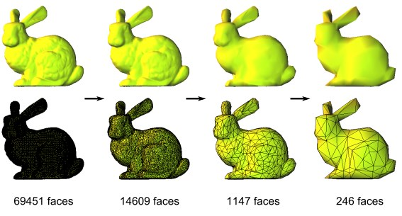

ProgressiveMeshes
=================

This is an implementation of the [progressive meshes](http://mgarland.org/files/papers/quadrics.pdf ) based on the mesh simplification algorithm proposed by [Garland and Heckbert](http://mgarland.org/files/papers/quadrics.pdf ). The original code is available on [Yusuke Yasui's website](http://yiusay.net/index.html#graphics&0). I did nothing but compiled it on Windows with Visual Studio 2010.

You should make sure `OpenGL` and `GLUT` are both installed correctly on you computer, before you use this code.

>Usage:   
>MeshSimplification *.off  

>left-click-drag: rotate  
>right-click-drag: translate  
>both left- and right-click-drag: scale  
>key 't': show/hide triangle edges  
>key 'c': perform edge collapse  
>key 's': perform vertex split  
>key 'z': reduce the number of faces by 5%  
>key 'x': the opposite of above operation.(i.e. increase the number of faces by 5%/(100-5))

